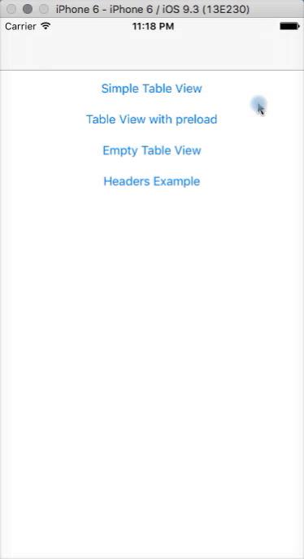
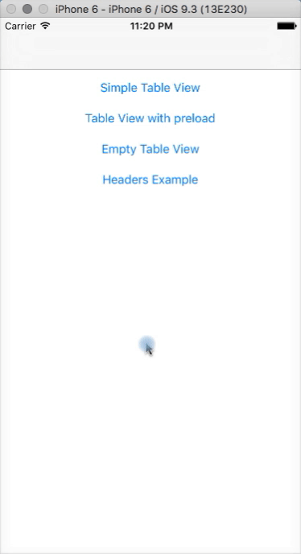
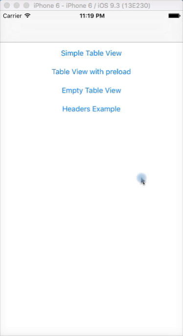

# Table View Manager

With few codes, you can build a complete table view with pagination, preload cells and empty data retrieved from API.

[](https://travis-ci.org/Marcelo Reis/MRTableViewManager)
[](http://cocoapods.org/pods/MRTableViewManager)
[](http://cocoapods.org/pods/MRTableViewManager)
[](http://cocoapods.org/pods/MRTableViewManager)

**Preload** | **Simple**	 |
:--:|:--:|	
 |  |
**Headers** | **Empty** |
 |  |

## Example

To run the example project, clone the repo, and run `pod install` from the Example directory first.

## Requirements and Details

* iOS 8.0+
* Xcode 7.3 or above
* Built with Swift 2.2
* [SwiftyJSON](https://github.com/SwiftyJSON/SwiftyJSON)


## Installation

### CocoaPods

```ruby
source 'https://github.com/CocoaPods/Specs.git'
platform :ios, '8.0'

target 'Your Project Name' do
    use_frameworks!
    // ...
    pod 'SwiftyJSON'
    pod 'MRTableViewManager', '~> 0.1.1'
    // ...
end
```

### Manually

Although it's not recommended, you just need to drop MRTableViewManager folder into Xcode project (make sure to enable "Copy items if needed" and "Create groups").

## Usage

#### Instatiating
```swift
import MRTableViewManager

class PreloadExampleTableViewController: UITableViewController, TableViewManagerDelegate {
// ...

let tableViewManager = MRTableViewManager()
```

## Information and Contact

Developed by [@marceloreis13](https://github.com/marceloreis13). 

Contact me either by Linkedin [@marceloreis13](https://www.linkedin.com/in/marceloreis13) or emailing me to [me@marcelo.cc](mailto:me@marcelo.cc).

## License
    The MIT License (MIT)
        Copyright (c) 2016 Marcelo Reis

        Permission is hereby granted, free of charge, to any person obtaining a copy
        of this software and associated documentation files (the "Software"), to deal
        in the Software without restriction, including without limitation the rights
        to use, copy, modify, merge, publish, distribute, sublicense, and/or sell
        copies of the Software, and to permit persons to whom the Software is
        furnished to do so, subject to the following conditions:

        The above copyright notice and this permission notice shall be included in
        all copies or substantial portions of the Software.

        THE SOFTWARE IS PROVIDED "AS IS", WITHOUT WARRANTY OF ANY KIND, EXPRESS OR
        IMPLIED, INCLUDING BUT NOT LIMITED TO THE WARRANTIES OF MERCHANTABILITY,
        FITNESS FOR A PARTICULAR PURPOSE AND NONINFRINGEMENT. IN NO EVENT SHALL THE
        AUTHORS OR COPYRIGHT HOLDERS BE LIABLE FOR ANY CLAIM, DAMAGES OR OTHER
        LIABILITY, WHETHER IN AN ACTION OF CONTRACT, TORT OR OTHERWISE, ARISING FROM,
        OUT OF OR IN CONNECTION WITH THE SOFTWARE OR THE USE OR OTHER DEALINGS IN
        THE SOFTWARE.